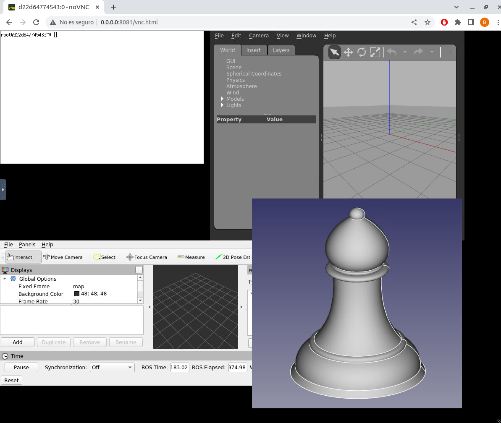

Esta semana he estado jugando con los contenedores docker para crear una imagen con *ubuntu-focal:20.04* que contenga varias aplicaiones robóticas. En concreto el docker contiene ROS noetic, gazebo y rviz, además de los programas necesarios para la visualización del docker con VNC. Esta imagen se puede crear con el Dockerfile dentro del directorio `noetic-docker` de mi repositorio de prácticas: [noetic-docker](https://github.com/TheRoboticsClub/2023-upe-blanca-soria/tree/main/noetic_docker).

Con esta imagen docker y abriendo un servicio VNC en el puerto 8081 he conseguido ejecutar 4 aplicaiones dentro del docker y visualizarlas en un browser. Estas 4 aplicaiones son Gazebo, Rviz, una consola y un porgrama sencillo en python que muestra una imagen de un alfil en OpneCV:

Además de generear esta imagen docker he estado aprendiendo lo más básico sobre html y css para crear una página web sencilla con 4 visores, clientes noVNC. Para ello he mirado varias lecciones de Juan Gonzalez Gomez en: https://github.com/myTeachingURJC/2020-2021-CSAAI/wiki .

Una vez hechos un par de tutoriales y basándome en la página ya creada por mi compañera [Lucia](https://github.com/lu164) he conseguido obtener una página sencilla con 4 visores conectados a los puertos 6080, 6081, 6082 y 1108.

Con esta pequeña interfaz ya he podido ejecutar varias aplicaciones en la misma utilizando distintos servidores VNC, uno para cada visor.

Para hacer más sencilla la ejecución he creado varios scripts que ejecutan ciertos servicios:

- **kill.sh** : mata todos los procesos que tienen que ver con las aplicaciones ejecutadas
- **start_gz.sh** : el primer script que ejecuta gazebo indicando el display, puerto interno y externo en el que se ejecutará VNC.
- **start_service** : inicia un servicio VNC en el display, puerto interno y externo indicados
- **start_all** : inicia 4 aplicaciones en los puertos asociados a la web de las 4 ventanas.Rviz solo funciona sise han ejecutado los comandos que crean un workspace indicados en *create_workspace.txt*.

Por ultimo, he estado revisando y profundizando en el funcionamiento del RAM, llegando a entender por completo su fucnionamiento junto con cada exercise.py y gui.py de cada ejercicio.

