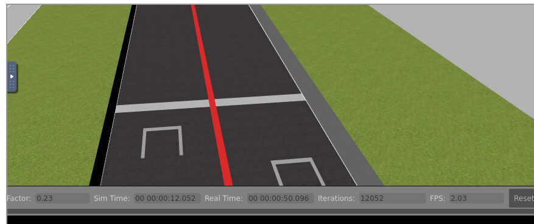
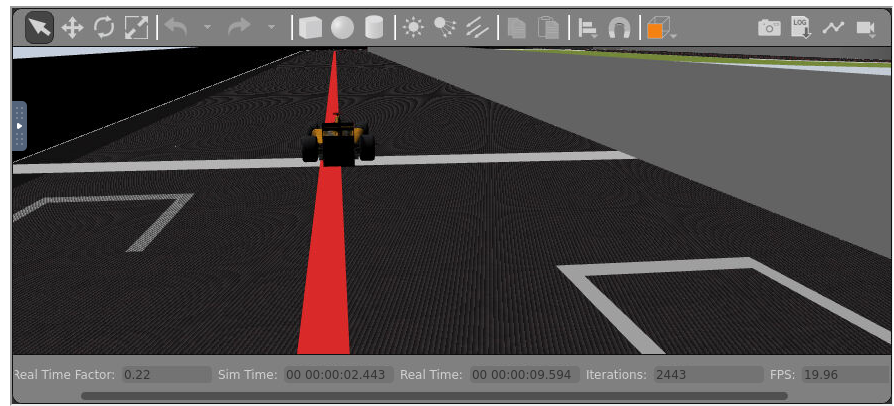
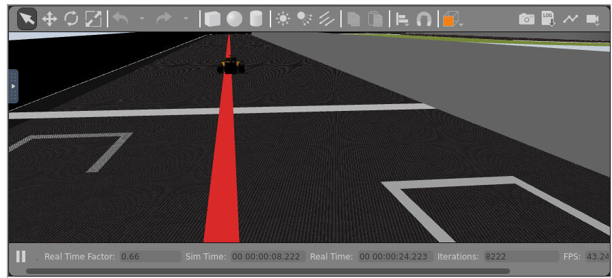

Esta semana ha estado enfocada a 2 tareas distintas:
- Actualizar el ejercicio de la aspiradora básica en ROS2
- Añadir la aceleración gráfica al RADI 4.3
Adicionalmente me he vuelto a meter en el ejercicio de Follow_line para actualizar en este y en el vaccum cleaner la posicion en la que se coloca la camara en gazebo, para así comenzar en un lugar adecuado sin necesidad de estar desplazandote con el ratón.

## VACCUM CLEANER
Inicialmente he tenido que crear un ejercicio nuevo en nuestro RoboticsAcademy de /tmp en CustomRobots con la configuración del vaccum cleaner. Para crear este ejrcicio he tenido que seguir estas [intrucciones](https://github.com/JdeRobot/RoboticsAcademy/blob/master/docs/InstructionsForDevelopers.md#how-to-add-a-new-exercise)

Dentro del `RoboticsAcademy/exercises/static/exercises`, actualizar el ejercicio vaccum_cleaner para ROS2 ha implicado:
- Cambiar los plugins de ROS que no funcionaban en ROS2 en el modelo de la aspiradora
- Cambiar el HAL para que un executor sea el que haga un spin al Laser y Pose3d
- Añadir al mundo un plugin que ponga a funcionar el servicio GetEntityState que usaremos para el bumper
- Cambiar el bumper para que se haga cliente de GetEntityState en vez de GetModelState y haga un spin especial
- Cambiar todos los publicadores y subscriptores de las interfaces de ROS a ROS2

Ademas en el resto de ficheros de web-template ha habido que hacer algun pequeño cambio para pasar de rospy a rclpy.

Finalmente he conseguido que todos los sensores fucnionen bien y un video de demostración es: [video]()

## ACELERACION GRÁFICA
El problema inicial que teniamos en este aspecto era uqe al intalar en la imagen docker TurboVNC todo el sistema de ficheros se rompía y no se podia seguir intstalando cosas de forma correcta. Tras analizar un poco el problema he descubierto que el paquete .deb que se intalaba era para una arquitectura de 32 y no de 64 bits , por lo que no habia manera de que esto funcionase. Con esto aprendido, conseguí instalar estos dos programas correctamente y crear un script `start_vnc_gpu.sh` que lanza un VNC con Turbovnc y un porgrama `check_device.py`. El segundo programa python devuelve un booleano diciendo si el dispositivo introucido como argumento existe, de manera que si hemos lanzado bien el contenedor habilitando la GPU debe devilver un True. El primer script lanza TurboVNC de manera que si queremos lanzar cualquier programa con ayuda de la aceleración gráfica tendremos que añadir `export VGL_DISPLAY=$DRI_PATH` sinedo $DRI_PATH la ruta al dispositivo , como por ejemplo `/dev/dri/card0`, y añadir `vglrun` antes de ejecutar cualquier comando. Un ejemplo de esto sería:
~~~
your_machine>> ./run.sh -t 4.3.0 --dev card0 -d
docker>>> python3 check_device.py /dev/dri/card0
True
docker>>> ./start_vnc_gpu.sh 0 5900 6080
...
docker>>> export VGL_DISPLAY=/dev/dri/card0 vglrun ros2 launch RoboticsAcademy/exercises/static/exercises/vaccum_cleaner_newmanager/web-template/launch/vaccum_cleaner.launch.py
...
docker>>> export VGL_DISPLAY=/dev/dri/card0 vglrun ros2 launch gazebo_ros gzclient.launch.py
~~~
Con esto podemos comprobar como los FPS y RTF de gazebo son mucho mejor que sin aceleración gráfica. 

A continuación hay que añadir esto al RAM; mi compañera Lucía ya habia metido parcialmente dentro de visor de gazebo que se lanzase con virtualGL. Yo he añadido que el vnc, si se ha habilitado la aceleración gráfica, lanza TurboVNC en vez de x11vnc y además que tambien usen esta ventaja el launcher (que por dentro lanza el gzserver) y la consola.Los resultados son los siguientes:

Sin aceleración gráfica:

Podemos ver como el RTF es de 0.23 y FPS 2.3

Con aceleración gráfica solo en el visor de gazebo(gzclient)

El RTF se mantiene igual pero los FPS pasan de 2.3 a 20

Con aceleración gráfica en gzserver, gzclient y la consola

Podemos ver como con la acelaración completa el RTF sube de un 0.2 a un 0.6 y los FPS a 40 (teniendo picos de 60 incluso)

Además de los datos numéricos, en la práctica podemos comprobar como gazebo va muchisimo mas fluido y todo el sistema puede apreciarse de mucha mejor manera.

Con esto podemos concluir con que la aceleración gráfica es muy util para poder trabajar en la plataforma de una manera eficiente y más comoda. Además he podido comprobar como no solo funciona con las tarfetas gráficas NVidia e Intel (que son las que ya se habían probado en el RADI anterior) , sino que tambiaen funciona con una AMD , que es la que tengo yo.

**Para lanzar el docker con las configuraciones adecuadas mirar este [README](https://github.com/JdeRobot/CustomRobots/blob/issue-205/README.md)**

