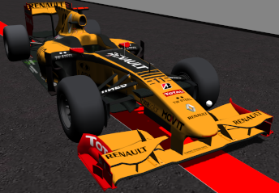

En esta semana principalmente me he centrado en coseguir que el ejercicio follow_line_newmanager funcione correctamete en ROS2 con el nuevo manager y REACT.

Para ello ha sido necesario cambiar algun detalle del modelo de formula1 y el mundo que se lanza con gazebo, es decir el launcher de este ejericio, ya que en este caso el modelo del robot se lanza directamente con el mundo a diferencia que con el turtlebot, que se spawneaba dentro del circuito vacío.

A parte de estos detalles del mundo no ha habido que cambiar practicamente nada de los ficheros de web-template de este ejercicio respecto a lo que habia hecho con el trutlebot.

Finalmente el [follow_line](https://youtu.be/PzGvYfdxelQ) con el Formula 1 funciona correctamente.

Mas adelante he cambiado el modelo de formula1 de el clásico al de renault, que tiene unos colores mas vistosos:

